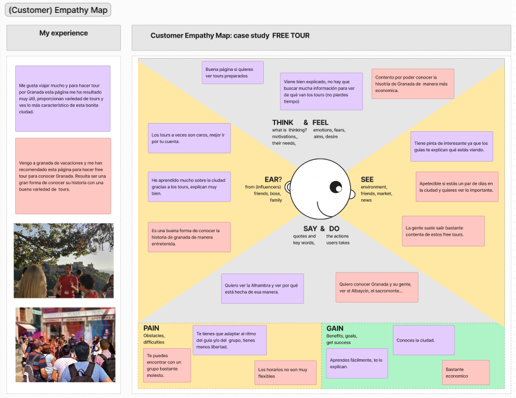

# DIU - Practica1, entregables

## Empathy map

Hemos realizado un mapa de empatía respectivo a la experiencia de nuestras personas, que caracterizan dos colectivos bastante frecuentes que utilizan nuestra página web. En general, la gente queda bastante contenta después de hacer los tours y aprende bastante ya que los guías te explican muchas cosas, pero por otra parte puede que a la gente le tire un poco para atrás el precio de algunos de los tours. Alguien que venga de fuera seguramente esté más dispuesto a pagar los tours que alguien que sea de España.

## Analisis Competitivo

Hemos realizado un análisis comparativo de nuestra página con otras páginas del sector, con el que hemos podido llegar a la conclusión de que nuestra página aunque es bastante buena en algunos aspectos deja bastante que desear en muchos otros teniendo bastante que mejorar, ya que actualmente es inferior en cuanto a prestaciones que las páginas de sus competidores.

## Personas

Hemos decidido crear dos personas que representan dos colectivos bastante frecuentes, el turismo europeo y el turismo nacional, los cuales son representados por  **Katharina** y **Sergio** respectivamente.

**Sergio**

Sergio es una persona que actualmente vive en Madrid. Es un gran apasionado de los viajes por lo que quiere hacer una escapada con su pareja para visitar Granada. Por ello está intentando reservar algún tour para poder conocer algo más sobre la historia de esta ciudad.

**Katharina**

Katharina es una persona que vive en Berlín, ama el arte y se dedica a ello, y busca inspiración para sus obras. Intenta visitar lugares para buscar allí ideas.

## User Journey Map  ( 1 por persona)

**Sergio**

Este caso se centra en el proceso de reserva de un viaje "express" muy habitual en el turismo nacional, y el problema que este suele conllevar con la disponibilidad por el hecho de organizarlo con poco tiempo de margen.

**Katharina**

En el caso de Katharina busca experiencias, y quiere que su viaje sea interesante y que aprenda mucho, y no sabe si realmente lo disfrutará porque no ve opiniones en los tours de la página.

## Revisión de Usabilidad 

En general podemos determinar que la funcionalidad de la página cumple con las metas y objetivos comunes del usuario, muestra la información clara y tiene una interfaz fácil de usar, pero vemos otras desventajas como la falta de un buscador que busque los tours deseados o los ordene por popularidad, calidad o precio. También se echa en falta una zona de comentarios, ya sea de la página en general o de los tours en específico, ya que es algo que es importante, y al usuario suele interesarle ver opiniones sobre lo que quiere contratar.

Aparte de eso, la página tiene una página de inicio clara, aunque al tener que bajar mucho para verlo todo puede ser tedioso. Tiene buena navegación, aunque no hay elementos como navegación por nombre, más reciente, etc.

Los errores en general se manejan bien, dejan claro lo que se necesita, aunque a veces cuando hay varios errores al rellenar algún formulario, solo muestra uno de ellos, esto puede ser un poco frustrante para el usuario, ya que al arreglar el error que se le muestra, le saldrá otro seguidamente.

El contenido está en un lenguaje claro y apropiado. El contenido es legible en la página.

La ayuda que ofrece la página está bien, pero la ayuda en línea es con un bot que no siempre responde las preguntas 
que necesitas. Ofrece otro tipo de ayudas como teléfono, correo electrónico, o un formulario en la página.

El rendimiento de la página es óptimo, no se queda bloqueado ni inhibe la experencia del usuario.
