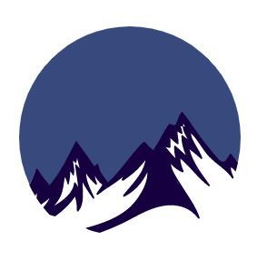
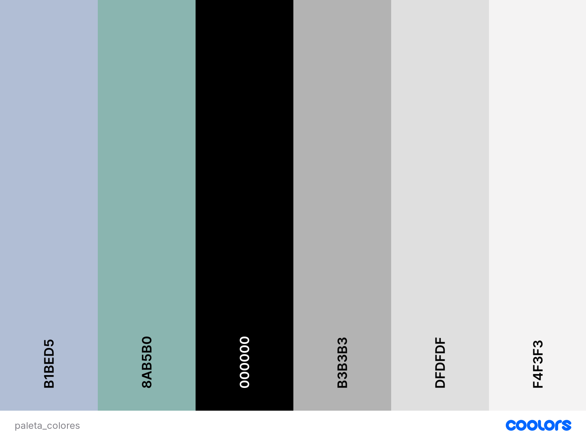

# DIU - Practica 3, entregables

## Moodboard (diseño visual + logotipo)   

## Landing Page

## Guidelines
A continuación definiremos los distintos componentes de nuestra aplicación.

- ### Logotipo
Para la creación de nuestro logotipo hemos creado diferentes versiones:

Al final hemos decidido usar las distintas versiones del logo según nos sea conveniente.

- ### Paleta de colores
Para la paleta de colores nos hemos decantado por una gama de colores pastel, para tener un diseño simple y limpio, con unos colores suaves que no desagraden a la vista del usuario.

La paleta elegida es la siguiente:

- ### Tipografía
Para la tipografía hemos elegido un tipo de letra simple, claro y limpio, para tener una tipografía que resulte atactiva y fácil de entender para el cliente.

Para ello nos hemos decidido por tres tipografías:
* **M PLUS 1p Light**: Esta será la tipografía elegida para los títulos de nuestra página, tendrá un tamaño de fuente de 37.5

* **Fahkwang ExtraLight**: Esta es la elegida para los subtítulos de la página y será de tamaño 17.

* **Heebo Light**: Esta es la elegida para el texto genérico y será de tamaño 11.

- ### Iconografía.
Hemos elegido una selección de los iconos suministrados por google, los cuales se adecúan para nuestra página. Estos tienen un diseño minimalista, de fácil interpretación por el usuario, además de estar altamente reconocidos por los distintos usuarios de la red.

- ### Patrón de diseño.
Para este apartado hemos usado varios patrones de diseño, respecto a la navegación, a la manera de mostrar los datos, etc. 

- Búsqueda:
1. Patrón caja de búsqueda: se utiliza para la búsqueda de tours introduciendo texto para buscar un tour en concreto.

- Para los inputs:
1. Selector de calendario: muestra un calendario para seleccionar un día, mostrando los días libres en un solo vistazo.
2. Ajustes: el usuario necesita un apartado para cambiar sus datos.

- Para la navegación:
1. Navegación por pestañas: se utiliza para el menú principal que se muestra en la parte superior en todas las páginas, para hacer más fácil el acceso a cualquier página dondequiera que esté navegando el usuario.
2. Breadcrumbs: resaltar en el menú principal en qué pestaña está ahora mismo el usuario.
3. Home link: el usuario puede volver a la página principal fácilmente (clicando el logo).
4. Carrusel: El usuario necesita navegar entre una serie de ítems (en este caso, comentarios).

- Manera de mostrar datos:
1. Filtros de búsqueda: usamos filtros de búsqueda para filtrar los tipos de tours y que sea más fácil para el usuario ver los tours que le interesen.

- Onboarding:
1. Registro de cuenta: para saber quién es el usuario activo para proveerle contenido personalizado u oportunidades para realizar a una compra.

- Social:
1. Testimonios: para mostrar valoraciones de usuarios que ya han probado nuestros tours e inciten al usuario a probar el tour.

- Shopping:
1. Página del producto: El usuario necesita detalles del tour para saber si le interesa o cómo se realiza el mismo.
2. Cupón: para incentivar al usuario a que compre tours mostrándole ofertas.

- ### Estilo de lenguaje
Para nuestra página hemos optado por un estilo de lenguaje sencillo, sin ser muy vulgar y sin el uso de muchos tecnicismos, para que sea lo más fácil de entender posible.

## Mockup: LAYOUT HI-FI
Hemos realizado los siguientes layout para nuestra página:

- Página principal

- Registro e Inicio de Sesión:

- Perfil y Tours

- Empresa

- Contacto:

- Tour Especifico:

- Reservas:

## Documentación: Publicación del Case Study

(incluye) Valoración del equipo sobre la realización de esta práctica o los problemas surgidos
En nuestro Case Study hemos propuesto un rediseño de la página [free-tourgranada](https://freetour-granada.com), para hacer mejoras en el diseño, la navegación y proponer nuevos tours de montaña y otras zona de la provincia, que no sea solo Granada capital. Hemos pensado un logo nuevo que intente transmitir esa idea de tours de montaña, mostrando una montaña. Luego hemos ideado una paleta de colores que transmita tranquilidad y naturaleza.

Aquí mostramos cómo quedaría el nuevo diseño:

- Página principal 

 
- Registro e Inicio de Sesión:

- Perfil y Tours

- Empresa

- Contacto:

- Tour Especifico:

- Reservas:

 
