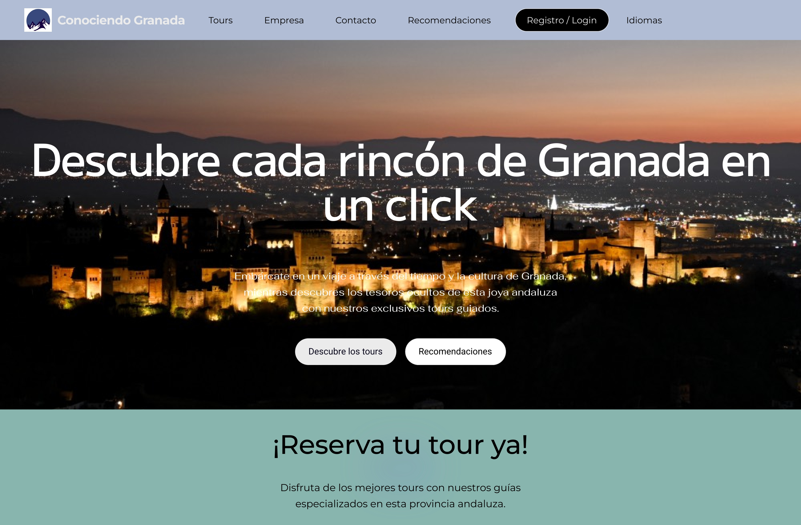
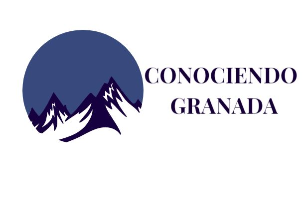
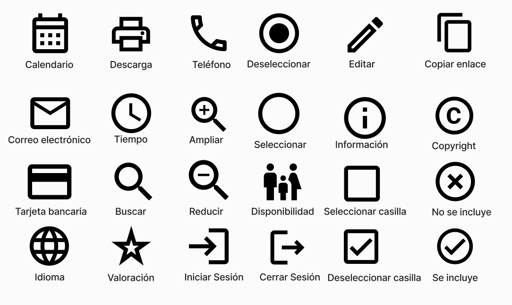

# DIU - Practica 3, entregables

## Moodboard (diseño visual + logotipo)   

## Landing Page

## Guidelines
A continuación definiremos los distintos componentes de nuestra aplicación.

- ### Logotipo
Para la creación de nuestro logotipo hemos creado diferentes versiones:

Al final hemos decidido usar las distintas versiones del logo según nos sea conveniente.

- ### Paleta de colores
Para la  paleta de colores nos hemos decantado por una gama de colores pastel, para tener un diseño simple y limpio, con unos colores suaves que no desagraden a la vista del usuario.

La paleta elegida es la siguiente:

- ### Tipografía
Para la tipografía hemos elegido un tipo de letra simple, claro y limpio, para tener una tipografía que resulte atactiva y facil de entender para el cliente.

Para ello nos hemos decidico por tres tipografias:
* **M PLUS 1p Light**: Esta será la tipografía elegida para los títulos de nuestra página, tendrá un tamaño de fuente de 37.5

* **Fahkwang ExtraLight**: Esta es la elegida para los subtitulos de la página y será de tamaño 17.

* **Heebo Light**: Esta es la elegida para el texto generico y será de tamaño 11.

- ### Iconografía.
Hemos elegido una selección de los iconos suministrados por google, los cuales se adecuan para nuestra página. Estos tienen un diseño minimalista, de facil interpretación por el usuario, además de estar altamente reconocidos por los distintos usuarios de la red.

- ### Patron de diseño.

- ### Estilo de lenguaje
Para nuestra página hemos optado por un estilo de lenguaje sencillo, sin ser muy vulgar y sin el uso de muchos tecnicismos, para que sea lo más facil de entender posible.

## Mockup: LAYOUT HI-FI
Hemos realiado los siguientes layout para nuestra página:

- Página principal

- Registro e Inicio de Sesión:

- Perfil y Tours

- Empresa

- Contacto:

- Tour Especifico:

- Reservas:

## Documentación: Publicación del Case Study

(incluye) Valoración del equipo sobre la realización de esta práctica o los problemas surgidos
 
