## Practica 5: entregables 

## Usuarios 

Para realizar el proceso de Eye Tracking se han seleccionado inicialmente 3 personas:
#### Dos usuarios expertos:
  - Ana López Mohedano
  - Ignacio Tovar Delgado
#### Un usuario objetivo:
  - Madre Ana

En este caso la elección de usuarios se ha visto condicionada por la aplicación utilizada GazeRecorder, debido a que para poder realizar más estudios o compartir estos es necesario pagar por una cuenta premiun en la aplicación.

## Tareas realizadas 

El principal objetivo es analizar e identificar las secciones sobre las que los usuarios dirigen su atención, obteniendo los puntos de interés (AOI) del sitio web. Este test ha sido realizado por el equipo DIU2.Anig, en el que se valorará el prototipo del equipo DIU3.CafeDerramao y el propio de DIU2.Anig.
Para realizar este test se ha visitado las distintas páginas de ambos prototipos, estando en cada una de ellas entre 10 y 12 segundos.

## Problemas en el estudio
Como se puede observar en una gran parte de las imágenes del mapa de calor, los resultados no parecen ser correctos, debido a que la herramienta GazeRecorder, en este caso no realizaba la calibración de los ojos correctamente, por lo que se puede apreciar en una gran parte de las fotos que el mapa de calor se centra en la parte izquierda de la página, sobre todo en los casos de la madre de Ana y el de Ignacio.

## A/B Testing. 

A continuación tenemos los resultados del EyeTracking desde la perspectiva de los distintos usuarios para los distintos prototipos a analizar:
### Caso A
Como caso A asignamos nuestro proyecto Conociendo Granada. A continuación se muestran algunos resultados de los distintos usuarios:

Ignacio:

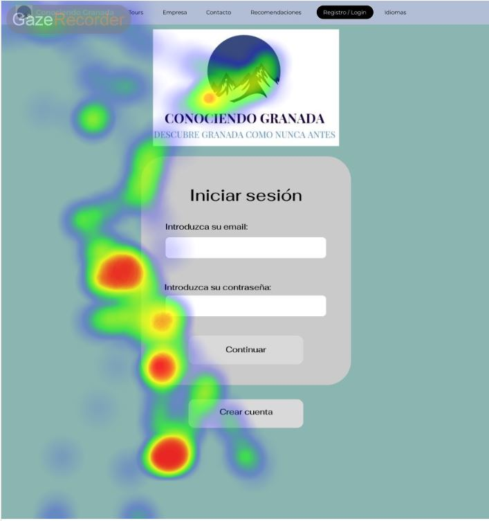

Ana:

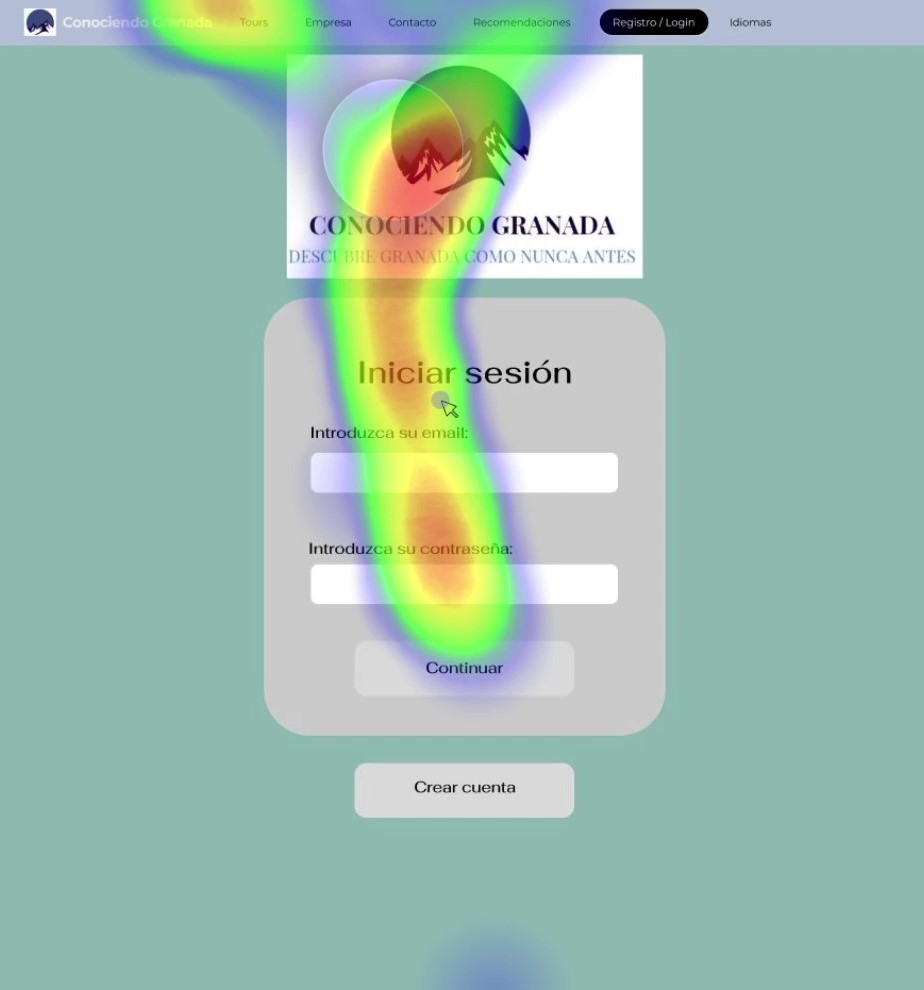

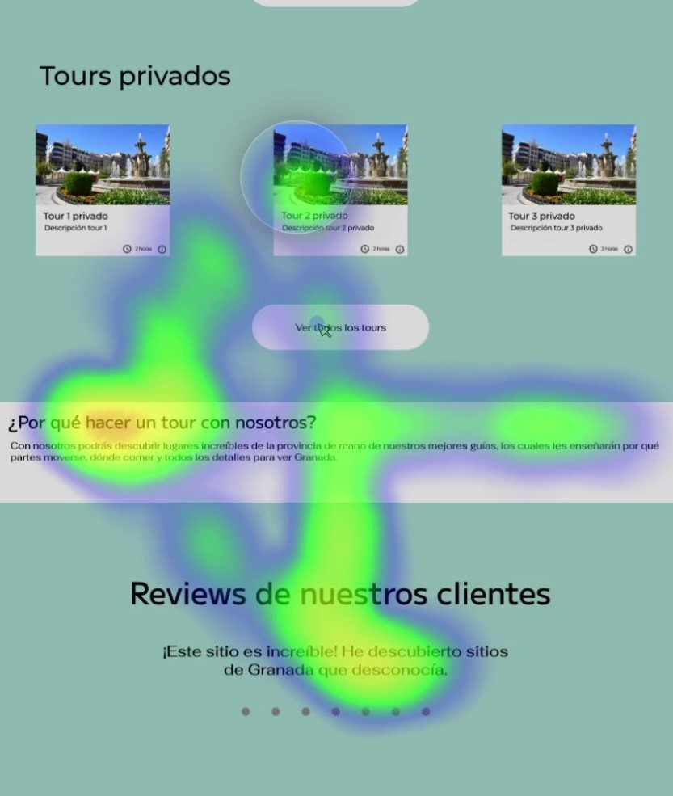

Madre Ana:

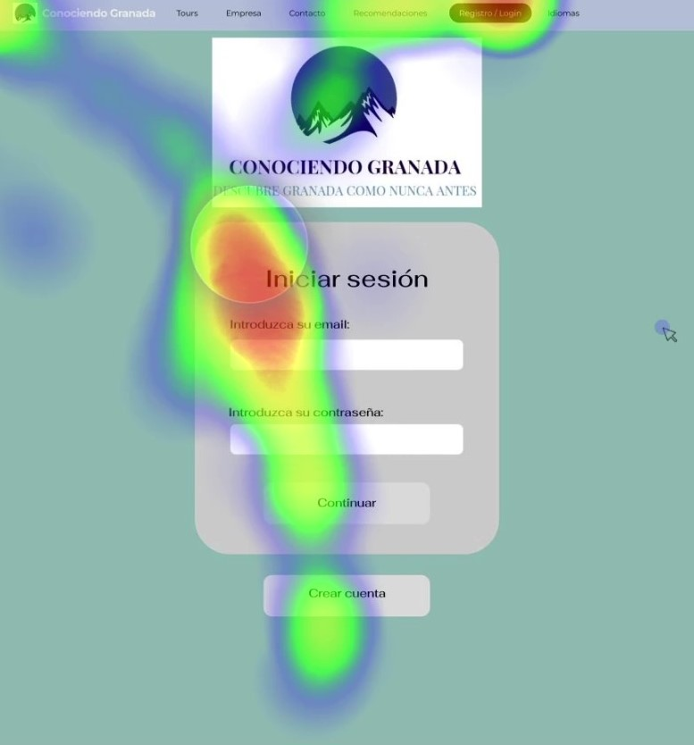

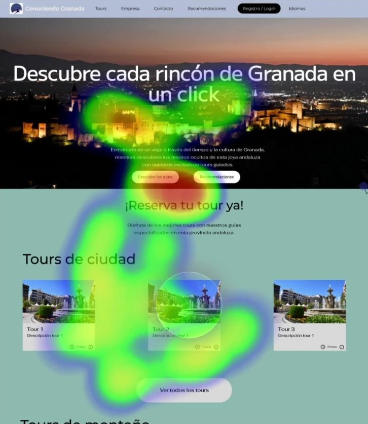

>>> Insertar algunas fotos de los resultados AOI

Para ver todos los resultados obtenidos puede visualizar la carpeta 

### Caso B
Como caso B asignamos el proyecto de los compañeros CafeDerramao. A continuación se muestran algunos resultados de los distintos usuarios:

Ignacio:

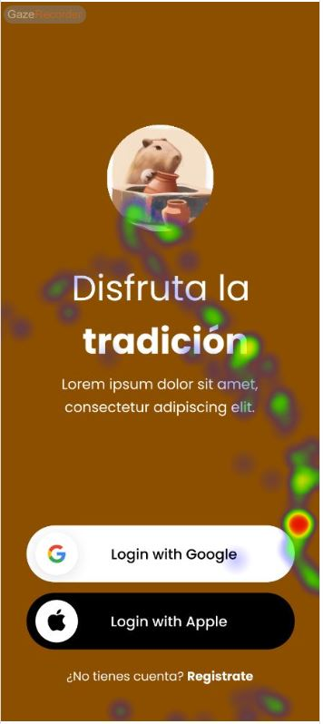

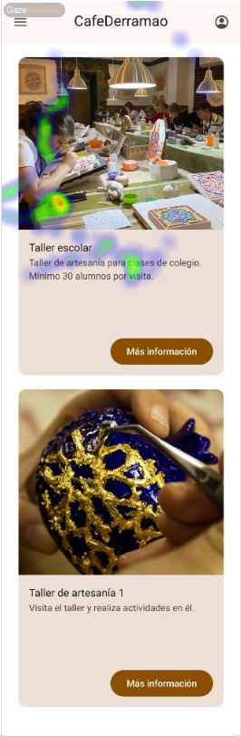

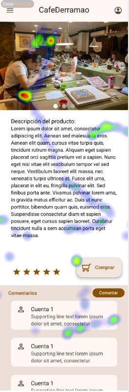

Ana:

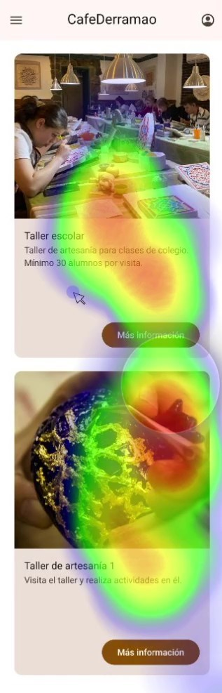

Madre Ana:

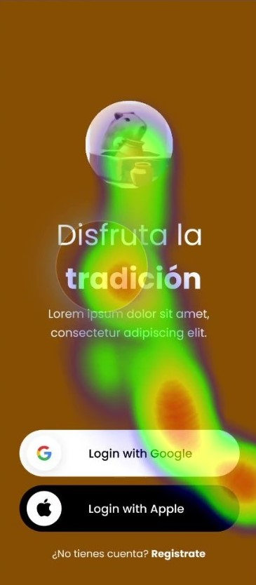

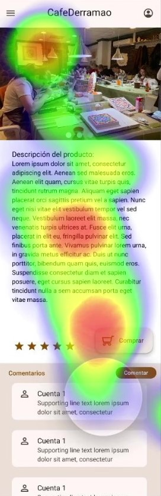

Algunas de las fotos de los puntos de interés (AOIs) hechos con los heatmap de la madre de Ana:

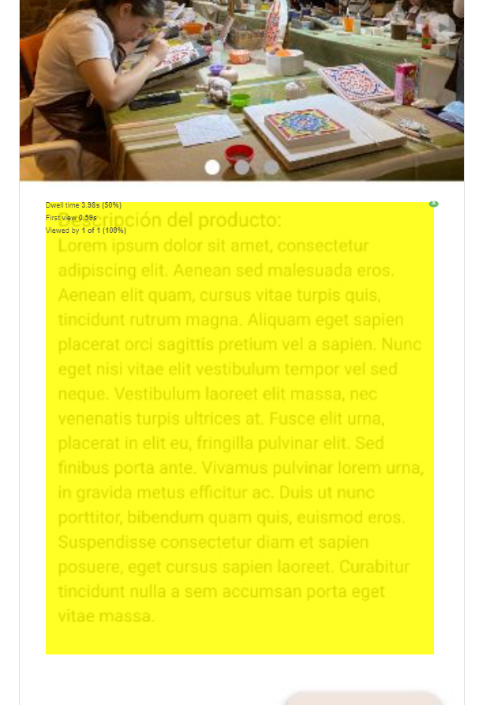

Para ver todos los resultados obtenidos puede visualizar la carpeta 

## Conclusiones

Tras realizar varios análisis de heatmap en nuestro sitio web desde la perspectiva de varios usuarios, hemos obtenido información valiosa sobre la atención y el comportamiento de los usuarios. Al analizar los resultados, podemos extraer conclusiones importantes.

Los heatmap nos han proporcionado una representación visual de las áreas de mayor interacción en nuestra aplicación. Hemos observado que las secciones clave, como los botones de llamada a la acción, enlaces importantes y elementos interactivos, han recibido una atención significativa por parte de los usuarios. Esto indica que el diseño y la disposición de estos elementos son efectivos para captar la atención de los usuarios y guiarlos hacia las acciones deseadas.

En general, a partir de la información obtenida de los heatmap, podemos concluir que la aplicación cuenta con la atención que se pretendía. Los usuarios están interactuando con los elementos clave de manera consistente, lo que sugiere que el diseño cumple con su cometido esperado al guiar a los usuarios hacia las acciones deseadas.
