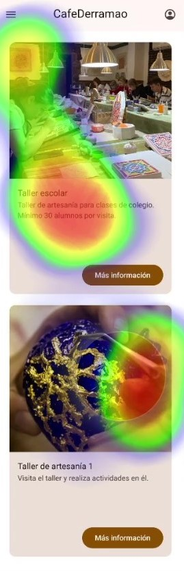

# DIU23
Prácticas Diseño Interfaces de Usuario 2022-23 (Tema: ... ) 

Grupo: DIU2.Anig  Curso: 2022/23 
Updated: 11/1/2023

Proyecto: 
>>> Conociendo Granada

Descripción: 

>>> Crear una página que ofrezca tours de distintos tipos (gratuitos, de pago, privados), para conocer los distintos rincones de la provincia de Granada, tanto la ciudad, como la montaña o la costa. Para incentivar a los clientes a visitar la página se crearán y se mandaran ofertas temporales mediante un sistema de suscripción.

Logotipo: 

Miembros
 * :bust_in_silhouette:   Ana López Mohedano     :octocat:     
 * :bust_in_silhouette:  Ignacio Tovar Delgado     :octocat:

----- 

>>> Este documento es el esqueleto del report final de la práctica. Aparte de subir cada entrega a PRADO, se debe actualizar y dar formato de informe final a este documento online. Elimine este texto desde la práctica 1

# Proceso de Diseño 

## Paso 1. UX Desk Research & Analisis 

 1.a Competitive Analysis
-----

Hemos realizado un analisis competitivo entre las principales páginas de free tour por Granada. Se ha realizado la comparación entre:
- [FreeTour Granada](https://freetour-granada.com/): Esta es la opcion proporcionada. Bastante mejorable en distintos aspectos.
- [Nazari Tours](https://nazaritoursgranada.com/): Esta opcion resulta mejor que la proporcionada pero aun así deja que desear en algunos aspectos.
- [WalkIn Granada](https://walkingranada.com/): Se trata de una opción mucho mejor que la proporcionada con una interfaz e implementación más agradable y sencilla.

 1.b Persona
-----

Las personas elegidas representan colectivos de usuarios habituales a nuestro producto.

**Sergio**

Sergio es una persona que actualmente vive en Madrid. Es un gran apasionado de los viajes por lo que quiere hacer una escapada con su pareja para visitar Granada. Por ello está intentando reservar algún tour para poder conocer algo más sobre la historia de esta ciudad.

**Katherine**

Katherine es una persona muy creativa que busca siempre inspiración para nuevas obras, y le gusta mucho aprender y conocer gente por el camino.

 1.c User Journey Map
----
 
**Sergio**

Se ha cogido la experiencia de Sergio debido a que es una experiencia muy habitual a la hora de querer visitar una ciudad y querer realizar un free tour

;

**Katherine**

Katherine busca viajar a sitios nuevos y ver esculturas y elementos artísticos interesantes, pero no sabe si le interesará el tour que va a contratar ya que falta información o fotos sobre él.

 1.d Usability Review
----
>>>  Revisión de usabilidad: (toma los siguientes documentos de referncia y verifica puntos de verificación de  usabilidad
>>>> SE deben incluir claramente los siguientes elementos
>>> - Enlace al documento:  (sube a github el xls/pdf) 
>>> - Valoración final (numérica): 82
>>> - Comentario sobre la valoración:  (60-120 caracteres)

Comentario sobre la usabilidad de la página web:

En general podemos determinar que la funcionalidad de la página cumple con las metas y objetivos comunes del usuario, muestra la información clara y tiene una interfaz fácil de usar, pero vemos otras desventajas como la falta de un buscador que busque los tours deseados o los ordene por popularidad, calidad o precio. También se echa en falta una zona de comentarios, ya sea de la página en general o de los tours en específico, ya que es algo que es importante, y al usuario suele interesarle ver opiniones sobre lo que quiere contratar.

Aparte de eso, la página tiene una página de inicio clara, aunque al tener que bajar mucho para verlo todo puede ser tedioso. Tiene buena navegación, aunque no hay elementos como navegación por nombre, más reciente, etc.

Los errores en general se manejan bien, dejan claro lo que se necesita, aunque a veces cuando hay varios errores al rellenar algún formulario, solo muestra uno de ellos, esto puede ser un poco frustrante para el usuario, ya que al arreglar el error que se le muestra, le saldrá otro seguidamente.

El contenido está en un lenguaje claro y apropiado. El contenido es legible en la página.

La ayuda que ofrece la página está bien, pero la ayuda en línea es con un bot que no siempre responde las preguntas que necesitas. Ofrece otro tipo de ayudas como teléfono, correo electrónico, o un formulario en la página.

El rendimiento de la página es óptimo, no se queda bloqueado ni inhibe la experencia del usuario.

## Paso 2. UX Design  

 2.a Feedback Capture Grid / EMpathy map / POV
----

  
    
>>> ¿Que planteas como "propuesta de valor" para un nuevo diseño de aplicación para economia colaborativa ?
>>> Problema e hipótesis
>>>  Que planteas como "propuesta de valor" para un nuevo diseño de aplicación para economia colaborativa te
>>> (150-200 caracteres)

 2.b ScopeCanvas
----
 

 2.b Tasks analysis 
-----

 

 2.c IA: Sitemap + Labelling 
----

 2.d Wireframes
-----

>>> Plantear el  diseño del layout para Web/movil (organización y simulación ) 

## Paso 3. Mi UX-Case Study (diseño)

 3.a Moodboard
-----

Para la realización del Moodboard hemos utilizado la plantilla proporcionada en Figma. En ella se han incluido varios logotipos, la paleta de colores que hemos elegido finalmente y las distintas fuentes que usaremos.
Para la creación del logotipo hemos utilizado la herramienta Designevo. En su creación hemos realizado distintas versiones del logotipo que pueden ser vistas en el readme de la carpeta P3.
Se han incluido distintas imágenes inspiradoras que nos han servido para guiarnos en las elecciones a tomar en la página como la paleta de colores o el logotipo. Para los logotipos hemos realizado una selección de los que nos serán necesarios para nuestra página. Para la paleta de colores hemos realizado una selección de colores pastel claros en los que destacan uno azulado y otro verdoso que serán los colores principales de nuestra página.

  3.b Landing Page
----

Para la creación de nuestra Landing Page, hemos realizado una versión inicial, la cual será utilizada para realizar nuestra página principal.
Para el título hemos elegido una frase que llame la atención del usuario, y la hemos complementado con una frase que resalte la propuesta de nuestra web. Como fondo hemos utilizado una foto en la que se ve el momunmento más característico de Granada como es la Alhambra, que además se ve el resto de Granada tras ella.

 3.c Guidelines
----

A continuación definiremos los distintos componentes de nuestra aplicación.

- ### Logotipo
Para la creación de nuestro logotipo hemos creado diferentes versiones:

Al final hemos decidido usar las distintas versiones del logo según nos sea conveniente.

- ### Paleta de colores
Para la paleta de colores nos hemos decantado por una gama de colores pastel, para tener un diseño simple y limpio, con unos colores suaves que no desagraden a la vista del usuario.

La paleta elegida es la siguiente:

- ### Tipografía
Para la tipografía hemos elegido un tipo de letra simple, claro y limpio, para tener una tipografía que resulte atactiva y fácil de entender para el cliente.

Para ello nos hemos decidido por tres tipografías:
* **M PLUS 1p Light**: Esta será la tipografía elegida para los títulos de nuestra página, tendrá un tamaño de fuente de 37.5

* **Fahkwang ExtraLight**: Esta es la elegida para los subtítulos de la página y será de tamaño 17.

* **Heebo Light**: Esta es la elegida para el texto genérico y será de tamaño 11.

- ### Iconografía.
Hemos elegido una selección de los iconos suministrados por google, los cuales se adecúan para nuestra página. Estos tienen un diseño minimalista, de fácil interpretación por el usuario, además de estar altamente reconocidos por los distintos usuarios de la red.

- ### Patrón de diseño.
Para este apartado hemos usado varios patrones de diseño, respecto a la navegación, a la manera de mostrar los datos, etc. A continuación los enumeramos, se describen con más detalle en el readme de la P3.

- Búsqueda:
1. Patrón caja de búsqueda.

- Para los inputs:
1. Selector de calendario.
2. Ajustes.

- Para la navegación:
1. Navegación por pestañas.
2. Breadcrumbs.
3. Home link.
4. Carrusel.

- Manera de mostrar datos:
1. Filtros de búsqueda.

- Onboarding:
1. Registro de cuenta.

- Social:
1. Testimonios.

- Shopping:
1. Página del producto.
2. Cupón.

- ### Estilo de lenguaje
Para nuestra página hemos optado por un estilo de lenguaje sencillo, sin ser muy vulgar y sin el uso de muchos tecnicismos, para que sea lo más fácil de entender posible.

  3.d Mockup
----

Para la realización del Mockup hemos desarrollado los distintos bocetos Lo-Fi que realizamos en la práctica anterior. Para la creación de ellos nos hemos basado en los puntos desarrollados anteriormente como el moodboard y Landing Page.

Para ello hemos realizado los distintos bocetos como la página principal, página de registro/inicio de sesión, contacto, tours... En la carpeta dedicada a la práctica 3 se pueden ver los distintos mockup en profundidad, además de poder acceder a un archivo figma donde se pueden ver desde primera mano los distintos bocetos-Hifi y una simulación que recrea nuestra página web con los distintos bocetos, en la que se puede navegar a través de ella.

## Paso 4. Evaluación 

 4.a Caso asignado
----

La idea de este Website es ofrecer actividades de artesanía con una perspectiva orientada al arte nazarí, con el objetivo de dar a conocer este tipo de artesanía y que la gente se interese más por ella. En esta web se dispone de información sobre distintos talleres, además de la opción de reserva y compra de ellos. Adicionalmente se pueden ver comentarios y opiniones de otros usuarios que hayan realizado los distintos talleres para un mayor feedback.

 4.b User Testing
----
Para realizar el proceso de User Testing se han seleccionado inicialmente 4 personas. Se ha usado el método role playing para definir sus características, emociones y comportamientos. A partir de lo siguiente hemos desarrolado los siguientes usuarios:

**Usuario 1:** Lucía
 - Tipo: 6 (Jubilado)
 - Actividad: 2 (Apasionado por los idiomas)
 - Emoción: 1 (cabreado)
 A partir de esta información hemos desarrollado el siguiente personaje: Lucía, jubilada, tiene un perfil que aporta inexperiencia en el uso de las nuevas tecnologías debido a su edad. Por ello, ha sido útil que realizara la valoración, teniendo como objetivo encontrar las deficiencias de diseño que pueden afectar a personas que no se desenvuelven del todo bien en estos entornos.
 
 **Usuario 2:** Carlos
 - Tipo: 2 (Familia)
 - Actividad: 5 (Apasionado por la fotografía)
 - Emoción: 4 (Sorprendido)
 A partir de esta informacíon hemos desarrollado el siguiente personaje: Carlos es un hombre de 40 años que trabaja como profesor y le encanta la fotografía. Se sorprende fácilmente y se emociona con las cosas simples. Por ello tiene un perfil de usuario de experiencia media que aporta positivismo a la página, ayudando a encontrar los puntos fuertes de ella, además de sus deficiencias en imagenes y diseño.
 
 **Usuario 3:** María
  - Tipo: 2 (Familia)
 - Actividad: 5 (Apasionado por la fotografía)
 - Emoción: 5 (Asqueada)
A partir de esta informacíon hemos desarrollado el siguiente personaje: María es una mujer de 40 años, arquitecta de profesión, que se dedica apasionadamente a los tours turísticos. Esta tiene un perfil que nos aporta una perspectiva profesional y artística,  pudiendo valorar la calidad de las descripciones y fotografías de los tours. Por lo tanto nos puede aportar una forma de evaluar en la que la plataforma le brinde una experiencia enriquecedora desde el punto de vista arquitectónico y fotográfico.

**Usuario 4:** David
 - Tipo: 5 (Ejecutivo)
 - Actividad: 1 (Apasionado por los nuevos conociemientos)
 - Emoción: 6 (Triste)
A partir de esta informacíon hemos desarrollado el siguiente personaje: David es un hombre de 35 años que trabaja como informático y atraviesa un momento de tristeza en su vida. Por ello nos aporta un perfil para evaluar con alto nivel de experiencia en internet, ademas de poder plantear un punto de vista negativo con altos conocimientos en diseño de páginas web.  También podría valorar la facilidad de uso de la página, buscando una navegación intuitiva y clara, así como información detallada y actualizada sobre los destinos turísticos disponibles. Además, es probable que David aprecie reseñas y testimonios de otros viajeros que hayan disfrutado de los tours, ya que esto podría brindarle una sensación de confianza y entusiasmo por elegir nuestros servicios.

| Usuarios | Sexo/Edad     | Ocupación   |  Exp.TIC    | Personalidad | Plataforma | TestA/B
| ------------- | -------- | ----------- | ----------- | -----------  | ---------- | ----
| Lucía         | M / 70   | Jubilado    | Baja        | Cabreada     | móvil.     | A 
| Carlos        | H / 40   | Profesor    | Media       | Sorpresivo   | Web        | A 
| María         | M / 40   | Arquitecta  | Media       | Asqueada     | Web        | B 
| David         | H / 35   | Informatico | Alta        | Triste       | Web        | B 

. 4.c Cuestionario SUS
----

Como podemos ver los resultados de ambas páginas son bastante satifactorios encontrandose ambas páginas en el rango aceptable tipo B, el cuál es un rango bastante aceptable. En ellas se pueden encontrar varías incosistencias en ellas

 4.d Usability Report
----

Este se puede encontrar dentro de la carpeta P4 o pulsando el siguiente enlace 

>>> ## Paso 5. Eye Tracking

## Usuarios 

Para realizar el proceso de Eye Tracking se han seleccionado inicialmente 3 personas:
#### Dos usuarios expertos:
  - Ana Lopez
  - Ignacio Tovar
#### Un usuario objetivo:
  - Madre Ana

En este caso la elección de usuarios se ha visto condicionada por la aplicación utilizada GazeRecorder, debido a que para poder realizar más estudios o compartir estos es necesario pagar por una cuenta premiun en la aplicación.

## Tareas realizadas 

El principal objetivo es analizar e identificar las secciones sobre las que los usuarios dirigen su atención, obteniendo los puntos de interés (AOI) del web,. Este test ha sido realizado por el equipo DIU2.Anig, en el que se valorará el prototipo del equipo DIU3.CafeDerramao.
Para realizar este test se ha visitado las distintas páginas de ambos prototipos, estando en cada una de ellas 10-12 segundos.

## Problemas en el estudio
Como se puede observar en una gran parte de las imagenes del mapa de calor, los resultados no parecen ser correctos, debido a que la herramienta GazeRecorder, en este caso no realizaba la calibración de los ojos correctamente, por lo que se puede apreciar en una gran parte de las fotos que el mapa de calor se centra en la parte izquierda de la página.

## A/B Testing. 

A continuación tenemos los resultados del EyeTracking desde la perspectiva de los distintos usuarios para los distintos prototipos a analizar:
### Caso A
Como caso A asignamos nuestro proyecto Conociendo Granada. A continuación se muestran algunos resultados de los distintos usuarios:

Ignacio:

Ana:

Madre Ana:

De este caso no tenemos los puntos de interés que se pueden obtener con la herramienta Gaze Recorder, ya que la segunda vez que accedes al proyecto no permite obtener los puntos de interés ni visualizar las imágenes, porque es de pago y permite hacer las cosas una vez.

Para ver todos los resultados obtenidos puede visualizar la carpeta 

### Caso B
Como caso B asignamos el proyecto de los compañeros CafeDerramao. A continuación se muestran algunos resultados de los distintos usuarios:

Ignacio:

Ana:

Madre Ana:

Algunas de las fotos de los puntos de interés (AOIs) hechos con los heatmap de la madre de Ana:

Para ver todos los resultados obtenidos puede visualizar la carpeta 

## Conclusiones

Tras realizar varios análisis de heatmap en nuestro sitio web desde la perspectiva de varios usuarios, hemos obtenido información valiosa sobre la atención y el comportamiento de los usuarios. Al analizar los resultados, podemos extraer conclusiones importantes.

Los heatmap nos han proporcionado una representación visual de las áreas de mayor interacción en nuestra aplicación. Hemos observado que las secciones clave, como los botones de llamada a la acción, enlaces importantes y elementos interactivos, han recibido una atención significativa por parte de los usuarios. Esto indica que el diseño y la disposición de estos elementos son efectivos para captar la atención de los usuarios y guiarlos hacia las acciones deseadas.

En general, a partir de la información obtenida de los heatmap, podemos concluir que la aplicación cuenta con la atención que se pretendía. Los usuarios están interactuando con los elementos clave de manera consistente, lo que sugiere que el diseño cumple con su cometido esperado al guiar a los usuarios hacia las acciones deseadas.

## Conclusión final / Valoración de las prácticas

Como conclusión final de las prácticas, podemos decir han sido muy gratificantes, debido a que se ha planteado un nuevo método de trabajo en el que, a partir de un primer análisis de una página con múltiples errores, hemos llegado a realizar nuestro propio proyecto de página web en el que hemos aplicado los distintos conocimientos que hemos ido adquiriendo a lo largo del curso para realizar un buen diseño de página atractiva que ofrezca una buena experiencia al usuario.

Hemos puesto en práctica técnicas de diseño web, usabilidad y experiencia de usuario, lo que nos ha permitido comprender la importancia de cada uno de estos aspectos en la creación de una página web. Además, hemos tenido la oportunidad de trabajar en un entorno colaborativo, lo que ha fomentado el intercambio de ideas y el trabajo en equipo.

Es importante destacar que este proyecto nos ha permitido comprender la importancia de considerar al usuario como el centro de nuestro trabajo. Hemos valorado la relevancia de crear una página web que se ajuste a las necesidades y expectativas de los usuarios, ofreciéndoles una experiencia intuitiva y agradable.

